# Hyprspace (Hyprland v0.52+ Edition)

**A workspace overview plugin for Hyprland, resurrected and modernized.**


> [!IMPORTANT]
> **Compatibility Alert**: This is a heavily modified fork designed specifically for **Hyprland v0.52 and newer**. It addresses the major API breaking changes that rendered the original plugin unusable.

---

## 📖 The Resurrection Story

Hyprland v0.52 introduced massive breaking changes to its internal API, leaving many plugins, including the beloved Hyprspace, in a broken state. With the original project seemingly inactive, this fork was created to bring it back to life.

We didn't just patch it; we rebuilt the core logic to align with modern Hyprland architecture:
*   **API Overhaul**: Migrated from deprecated `Desktop::View` namespaces to the new flat `desktop/` structure.
*   **Modern C++ Standards**: Updated to C++23 to match Hyprland's requirements.
*   **Fixing the Unfixable**: Solved complex linking errors (`undefined symbol`) and runtime crashes that plagued the migration process.

👉 **[Read the full War Story here (MIGRATION_JOURNEY.md)](MIGRATION_JOURNEY.md)** - A deep dive into the technical challenges of this migration.

---

## ✨ Features

- **Workspace Overview**: Visual overview of all workspaces with live window previews.
- **Drag & Drop**: Move windows between workspaces intuitively.
- **Multi-Monitor**: Seamless support for multi-head setups.
- **Touch Gestures**: Swipe to open/close (perfect for laptops).
- **Customizable**: Extensive styling options to match your rice.

## 📦 Installation

### Option 1: Arch Linux (AUR)

The easiest method. This package tracks this fork.

```bash
yay -S hyprspace-git
# or
paru -S hyprspace-git
```

### Option 2: Manual Build

**Prerequisites:**
*   Hyprland v0.52+ (headers must match your installed binary)
*   `gcc` / `g++` (C++23 support)
*   `pkg-config`
*   `pixman`, `libdrm`, `cairo`, `pango`

```bash
git clone https://github.com/Sidix130/Hyprspace.git
cd Hyprspace
make all
```

To install manually:
```bash
# Copy the compiled plugin to your Hyprland plugins directory
mkdir -p ~/.config/hypr/plugins
cp Hyprspace.so ~/.config/hypr/plugins/
```

### Option 3: Hyprpm

```bash
hyprpm add https://github.com/Sidix130/Hyprspace
hyprpm enable Hyprspace
```

---

## ⚙️ Configuration

Add this to your `hyprland.conf`:

```ini
# Load the plugin
plugin = ~/.config/hypr/plugins/Hyprspace.so

# Keybinding to toggle the overview
bind = SUPER, TAB, hyprspace:toggle
```

### Customization

You can tweak every aspect of the look and feel. Here is a robust default configuration:

```ini
plugin {
    overview {
        # Layout
        panelHeight = 250
        panelBorderWidth = 2
        workspaceMargin = 12
        reservedArea = 0
        centerAligned = true
        
        # Colors
        panelColor = rgba(0, 0, 0, 0.5)
        panelBorderColor = rgba(255, 255, 255, 0.2)
        workspaceActiveBackground = rgba(0, 0, 0, 0.25)
        workspaceInactiveBackground = rgba(0, 0, 0, 0.5)
        workspaceActiveBorder = rgba(255, 255, 255, 0.3)
        workspaceInactiveBorder = rgba(255, 255, 255, 0)
        
        # Behavior
        autoDrag = true
        autoScroll = true
        exitOnClick = true
        switchOnDrop = true
        showNewWorkspace = true
    }
}
```

## 🎮 Usage

*   **Open/Close**: Press your bind (`SUPER+TAB`) or swipe 3 fingers up/down (if gestures enabled).
*   **Move Windows**: Drag a window from one workspace to another.
*   **Create Workspace**: Click the "plus" icon or an empty space.
*   **Navigate**: Scroll wheel or arrow keys.


## 🏗️ Architecture

Here is a high-level overview of how Hyprspace interacts with Hyprland:

```mermaid
sequenceDiagram
    participant User
    participant Hyprland
    participant Plugin as Hyprspace (Plugin)
    participant Widget as CHyprspaceWidget
    participant Renderer as Render Loop

    Note over Hyprland, Plugin: Initialization
    Hyprland->>Plugin: PLUGIN_INIT
    Plugin->>Hyprland: Register Dispatchers (hyprspace:toggle)
    Plugin->>Hyprland: Register Hooks (Render, Input, Config)

    Note over User, Widget: Activation
    User->>Hyprland: Press SUPER+TAB
    Hyprland->>Plugin: dispatchToggleOverview()
    Plugin->>Widget: toggle()
    
    rect rgb(20, 20, 20)
        Note right of Widget: Show Animation
        Widget->>Hyprland: Unfullscreen Windows
        Widget->>Hyprland: Hide Overlay Layers
        Widget->>Widget: Calculate Grid Layout
        Widget->>Hyprland: damageMonitor() (Request Frame)
    end

    Note over Hyprland, Renderer: Rendering Cycle
    loop Every Frame
        Hyprland->>Plugin: Render Hook
        Plugin->>Widget: draw()
        Widget->>Renderer: Draw Background/Panel
        
        loop For Each Workspace
            Widget->>Renderer: Draw Workspace Box
            loop For Each Window
                Widget->>Renderer: renderWindowStub()
                Note right of Renderer: Scales & Translates Window<br/>to fit in the grid
            end
        end
    end
```


## 🤝 Contributing

Issues and Pull Requests are welcome! If you find a bug specific to Hyprland v0.52+, please report it.

## 🙏 Credits

*   **Original Author**: [KZDKM](https://github.com/KZDKM) - For creating this amazing plugin.
*   **Migration Lead**: [Sidix130](https://github.com/Sidix130) - For the v0.52+ port.
*   **Community**: All the contributors who kept the hope alive.

---
*Maintained with ❤️ for the Hyprland Community.*